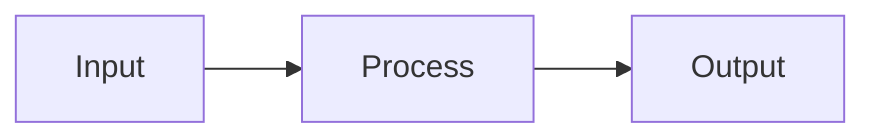

# Blog Post Templates

Direktori ini berisi template bilingual untuk membuat draft post Jekyll baru. Copy salah satu template ke `_posts/...` atau `_drafts/...`, lalu sesuaikan nama file, tanggal, front matter, dan isi tulisan.

## Pilihan Template

| Template | Bahasa | Kapan dipakai |
| --- | --- | --- |
| `ctf-writeup-id.md` | Indonesia | Writeup CTF berbahasa Indonesia dengan gaya santai namun tetap teknis. |
| `ctf-writeup-en.md` | English | CTF writeup dengan gaya technical blog natural seperti HackTricks, Trail of Bits, PortSwigger Research, atau Medium Engineering. |
| `tugas-id.md` | Indonesia | Artikel tugas kuliah, laporan praktikum, atau pembahasan akademik. |
| `tugas-en.md` | English | Coursework or assignment posts written in a clear technical report style. |
| `belajar-id.md` | Indonesia | Catatan belajar singkat untuk konsep, contoh, dan referensi pribadi. |
| `belajar-en.md` | English | Learning notes for concepts, examples, and reference material. |
| `project-id.md` | Indonesia | Dokumentasi project personal, kuliah, atau eksperimen teknis. |
| `project-en.md` | English | Project writeups covering architecture, trade-offs, implementation, and results. |

## Front Matter

Semua template memakai front matter dasar:

```yaml
---
layout: post
title:
description:
date: YYYY-MM-DD HH:MM:SS +0700
author: rafidghanim
categories:
tags:
toc: true
comments: true
image: /assets/img/avatar.jpg
---
```

Jangan hapus `layout`, `title`, `description`, `date`, `author`, `categories`, `tags`, `toc`, `comments`, atau `image` kecuali memang ingin mengubah behavior post. Field tersebut dipakai oleh Jekyll SEO Tag, feed, sitemap, halaman arsip, kategori, dan tag.

## Callout

Template memakai callout bawaan Chirpy:

```markdown
> Informasi tambahan.
{: .prompt-info }

> Hal yang perlu diperhatikan.
{: .prompt-warning }

> Tips praktis.
{: .prompt-tip }
```

## Mermaid

Gunakan blok Mermaid untuk diagram alur, arsitektur, atau proses analisis:

````markdown

````

Jika diagram tidak muncul, pastikan konfigurasi/theme yang dipakai memuat Mermaid untuk halaman post.

## Syntax Highlighting

Template sudah menyediakan contoh fenced code untuk:

- Python: ` ```python `
- JavaScript: ` ```javascript `
- Bash: ` ```bash `
- C: ` ```c `
- C++: ` ```cpp `
- YAML: ` ```yaml `
- Dockerfile: ` ```dockerfile `

Gunakan bahasa yang spesifik agar Rouge/Jekyll bisa memberi syntax highlighting yang tepat.
