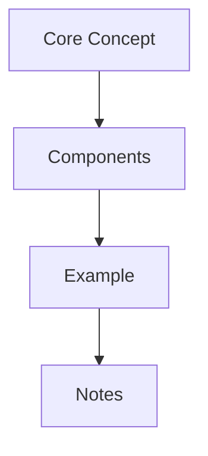

# Learning Notes: Topic

## Concept

Define the core idea and the high-level model behind the topic.

> Start with a simple mental model before diving into implementation details.
{: .prompt-info }

## Explanation

Explain how it works, which components matter, and how the pieces fit together.



> If two terms are commonly confused, call out the distinction explicitly.
{: .prompt-tip }

## Example

```python
print("Python example")
```

```javascript
console.log("JavaScript example");
```

```bash
echo "Bash example"
```

```c
#include <stdio.h>

int main(void) {
  puts("C example");
}
```

```cpp
#include <iostream>

int main() {
  std::cout << "C++ example\n";
}
```

```yaml
example:
  language: yaml
```

```dockerfile
FROM alpine:3.20
CMD ["echo", "Dockerfile example"]
```

> Small examples are usually more useful than large examples that hide the key idea.
{: .prompt-warning }

## Personal Notes

- What finally clicked.
- What is still unclear.
- Questions to revisit later.

## References

- [Reference Title](https://example.com)
- Books, papers, documentation, or supporting articles.
