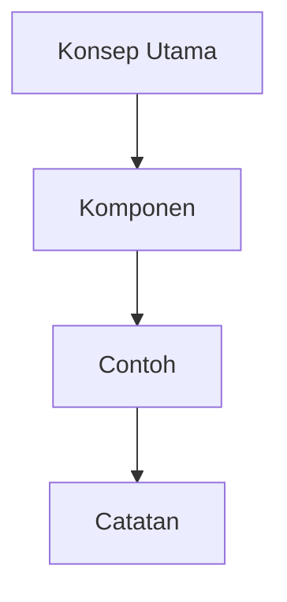

# Catatan Belajar: Topik

## Konsep

Tuliskan definisi inti dan gambaran besar topik yang sedang dipelajari.

> Mulai dari mental model sederhana sebelum masuk ke detail.
{: .prompt-info }

## Penjelasan

Jelaskan cara kerja, komponen penting, dan hubungan antar konsep.



> Kalau ada istilah yang sering tertukar, jelaskan bedanya di sini.
{: .prompt-tip }

## Contoh

```python
print("contoh Python")
```

```javascript
console.log("contoh JavaScript");
```

```bash
echo "contoh Bash"
```

```c
#include <stdio.h>

int main(void) {
  puts("contoh C");
}
```

```cpp
#include <iostream>

int main() {
  std::cout << "contoh C++\n";
}
```

```yaml
contoh:
  bahasa: yaml
```

```dockerfile
FROM alpine:3.20
CMD ["echo", "contoh Dockerfile"]
```

> Contoh kecil lebih baik daripada contoh besar yang susah dibaca.
{: .prompt-warning }

## Catatan Pribadi

- Hal yang baru dipahami.
- Bagian yang masih membingungkan.
- Pertanyaan untuk dipelajari lagi.

## Referensi

- [Judul Referensi](https://example.com)
- Buku, paper, dokumentasi, atau artikel pendukung.
