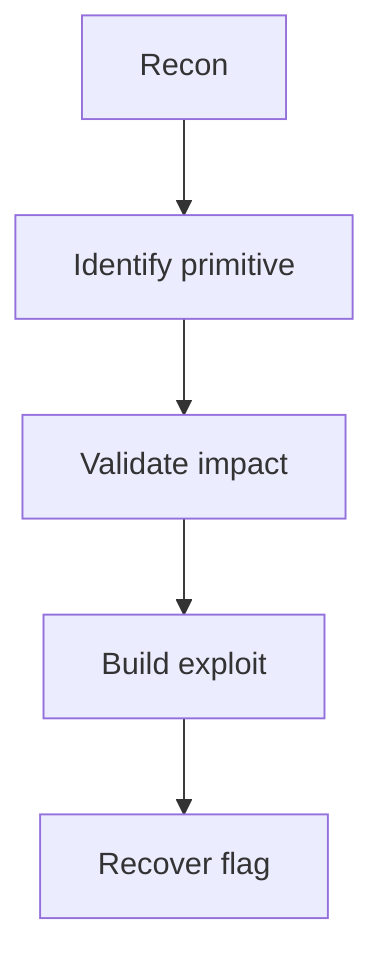

# [CTF] Challenge Title

## Summary

Briefly describe the target, challenge category, intended objective, and the core bug or technique used to solve it.

> Keep this section short enough that readers can decide whether the writeup is relevant to them.
{: .prompt-info }

## Challenge Information

| Field | Value |
| --- | --- |
| Event | CTF Name |
| Challenge | Challenge Name |
| Category | Web / Crypto / Pwn / Reverse / Forensics / Misc |
| Difficulty | Easy / Medium / Hard |
| Author | Author name |
| Files | [dist.zip](/path/to/file.zip) |

## Recon

Document the initial attack surface: provided files, exposed services, interesting endpoints, suspicious strings, binaries, metadata, or runtime behavior.

```bash
file chall
strings chall | head
checksec --file=chall
```

```yaml
target:
  host: example.com
  port: 1337
notes:
  - "The login endpoint accepts a JSON body."
```

## Analysis

Walk through the technical reasoning. Make each observation actionable: what it shows, why it matters, and how it narrows the exploit path.



> Strong writeups separate confirmed facts from guesses.
{: .prompt-tip }

### Code Notes

```python
def parse_response(data):
    return data.strip()
```

```javascript
const payload = { username: "admin", role: "admin" };
console.log(JSON.stringify(payload));
```

```c
#include <stdio.h>

int main(void) {
  puts("analysis");
  return 0;
}
```

```cpp
#include <iostream>

int main() {
  std::cout << "analysis\n";
}
```

```dockerfile
FROM python:3.12-slim
WORKDIR /app
COPY solver.py .
CMD ["python", "solver.py"]
```

## Exploitation

Explain the final exploit chain, payload structure, constraints, and why the primitive is enough to reach the flag.

```bash
python3 solver.py --host challenge.local --port 1337
```

> Do not run destructive payloads outside the challenge environment.
{: .prompt-warning }

## Solver

```python
#!/usr/bin/env python3

def main():
    print("TODO: implement solver")

if __name__ == "__main__":
    main()
```

## Flag

```text
CTF{flag_here}
```

## Lessons Learned

- The reusable technique or pattern.
- The failed assumption that changed the investigation.
- The tooling or debugging trick worth keeping.
