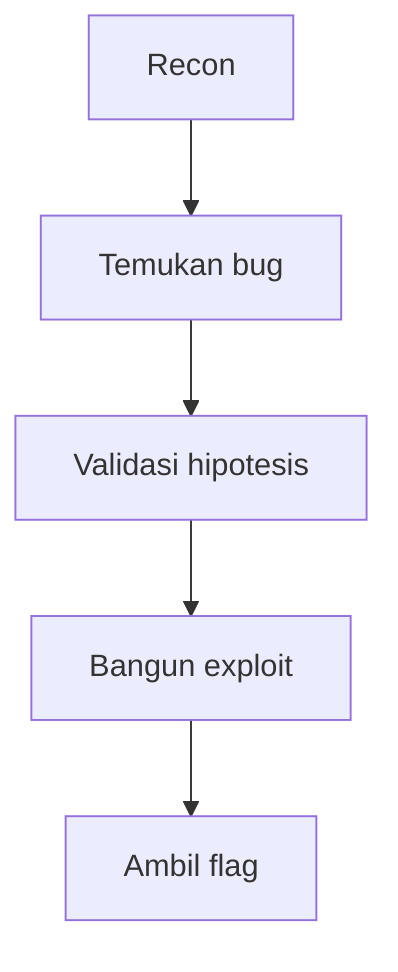

# [CTF] Judul Challenge

## Ringkasan

Tuliskan overview singkat challenge: apa objektifnya, kategori, tingkat kesulitan, dan ide utama penyelesaiannya.

> Gunakan bagian ini untuk memberi pembaca konteks sebelum masuk ke detail teknis.
{: .prompt-info }

## Informasi Challenge

| Field | Value |
| --- | --- |
| Event | Nama CTF |
| Challenge | Nama Challenge |
| Category | Web / Crypto / Pwn / Reverse / Forensics / Misc |
| Difficulty | Easy / Medium / Hard |
| Author | Nama author |
| Files | [dist.zip](/path/to/file.zip) |

## Recon

Catat observasi awal, file yang diberikan, service yang berjalan, endpoint menarik, string mencurigakan, atau behavior yang terlihat.

```bash
file chall
strings chall | head
checksec --file=chall
```

```yaml
target:
  host: example.com
  port: 1337
notes:
  - "Endpoint login menerima parameter JSON."
```

## Analisis

Jelaskan proses berpikir teknis secara runtut. Fokus ke fakta yang ditemukan, kenapa itu penting, dan bagaimana temuan tersebut mengarah ke solusi.



> Pastikan setiap asumsi punya bukti dari hasil recon atau eksperimen.
{: .prompt-tip }

### Catatan Kode

```python
def parse_response(data):
    return data.strip()
```

```javascript
const payload = { username: "admin", role: "admin" };
console.log(JSON.stringify(payload));
```

```c
#include <stdio.h>

int main(void) {
  puts("analysis");
  return 0;
}
```

```cpp
#include <iostream>

int main() {
  std::cout << "analysis\n";
}
```

```dockerfile
FROM python:3.12-slim
WORKDIR /app
COPY solver.py .
CMD ["python", "solver.py"]
```

## Eksploitasi

Jelaskan exploit akhir: payload, langkah eksekusi, dan kenapa exploit tersebut bekerja.

```bash
python3 solver.py --host challenge.local --port 1337
```

> Jangan jalankan payload destruktif di luar environment challenge.
{: .prompt-warning }

## Solver

```python
#!/usr/bin/env python3

def main():
    print("TODO: implement solver")

if __name__ == "__main__":
    main()
```

## Flag

```text
CTF{flag_di_sini}
```

## Lessons Learned

- Hal penting pertama yang dipelajari.
- Kesalahan atau dead end yang berguna untuk dicatat.
- Teknik yang bisa dipakai ulang di challenge berikutnya.
