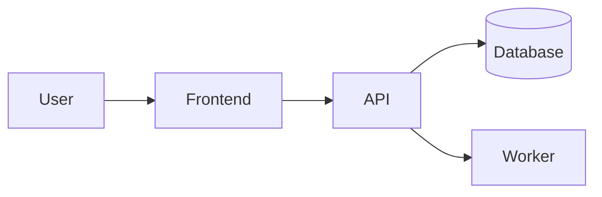

# Project: Project Name

## Background

Describe the problem, user context, and why this project exists.

> Start with the problem and constraints before introducing the technology stack.
{: .prompt-info }

## Architecture

Explain the system design, data flow, major components, and architectural boundaries.



## Technology

| Layer | Technology |
| --- | --- |
| Frontend | TBD |
| Backend | TBD |
| Database | TBD |
| Deployment | TBD |

```yaml
service:
  name: project-name
  environment: development
```

```dockerfile
FROM node:22-alpine
WORKDIR /app
COPY package*.json .
RUN npm ci
COPY . .
CMD ["npm", "start"]
```

## Challenges

- The first technical constraint.
- A design trade-off worth calling out.
- Performance, security, or operational concerns.

> Mention approaches you rejected when the trade-off is useful for the reader.
{: .prompt-tip }

## Solution

Describe the final implementation, key design decisions, and important code paths.

```javascript
export function normalizeInput(value) {
  return value.trim().toLowerCase();
}
```

```python
def normalize_input(value):
    return value.strip().lower()
```

```bash
npm run build
docker build -t project-name .
```

```c
#include <stdio.h>

int main(void) {
  puts("project");
}
```

```cpp
#include <iostream>

int main() {
  std::cout << "project\n";
}
```

> Never publish real secrets, tokens, or credentials in a project post.
{: .prompt-warning }

## Results

Summarize the outcome: features shipped, screenshots, benchmarks, demo links, or metrics.

| Metric | Result |
| --- | --- |
| Status | TBD |
| Main feature | TBD |
| Demo | TBD |

## Future Work

- Features to add next.
- Technical improvements or refactors.
- Risks to monitor.
