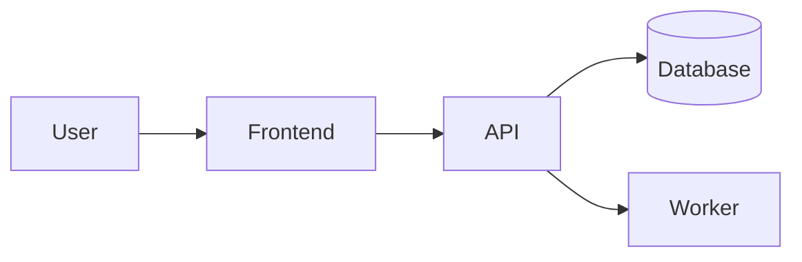

# Project: Nama Project

## Latar Belakang

Jelaskan masalah yang ingin diselesaikan, konteks pengguna, dan alasan project ini dibuat.

> Fokus pada masalah nyata sebelum membahas teknologi.
{: .prompt-info }

## Arsitektur

Jelaskan desain sistem, alur data, komponen utama, dan batasan arsitektur.



## Teknologi

| Layer | Teknologi |
| --- | --- |
| Frontend | TBD |
| Backend | TBD |
| Database | TBD |
| Deployment | TBD |

```yaml
service:
  name: nama-project
  environment: development
```

```dockerfile
FROM node:22-alpine
WORKDIR /app
COPY package*.json .
RUN npm ci
COPY . .
CMD ["npm", "start"]
```

## Tantangan

- Tantangan teknis pertama.
- Trade-off desain yang perlu dipilih.
- Kendala performa, keamanan, atau operasional.

> Tulis juga pendekatan yang tidak dipakai dan alasannya jika relevan.
{: .prompt-tip }

## Solusi

Jelaskan solusi akhir, keputusan desain, dan implementasi penting.

```javascript
export function normalizeInput(value) {
  return value.trim().toLowerCase();
}
```

```python
def normalize_input(value):
    return value.strip().lower()
```

```bash
npm run build
docker build -t nama-project .
```

```c
#include <stdio.h>

int main(void) {
  puts("project");
}
```

```cpp
#include <iostream>

int main() {
  std::cout << "project\n";
}
```

> Jangan simpan secret, token, atau kredensial asli di artikel.
{: .prompt-warning }

## Hasil

Tuliskan hasil yang dicapai: fitur, screenshot, benchmark, demo, atau metrik.

| Metrik | Hasil |
| --- | --- |
| Status | TBD |
| Fitur utama | TBD |
| Demo | TBD |

## Pengembangan Selanjutnya

- Fitur yang ingin ditambahkan.
- Refactor atau peningkatan teknis.
- Risiko yang perlu dipantau.
