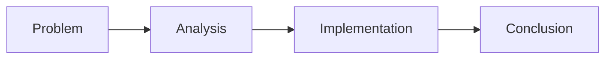

# Assignment Title

## Introduction

Introduce the topic, course context, and why the problem is worth discussing.

> The introduction should give readers enough context to understand the rest of the assignment.
{: .prompt-info }

## Problem Statement

- First research question or problem.
- Second research question or problem.
- Scope limitation, if any.

## Discussion

Explain the theory, core concepts, and analysis used to answer the problem statement.



> Good assignment writeups connect definitions to the actual problem being solved.
{: .prompt-tip }

## Implementation

Describe the method, workflow, simulation, configuration, or code used in the assignment.

```python
def average(values):
    return sum(values) / len(values)
```

```javascript
const values = [80, 90, 85];
const average = values.reduce((a, b) => a + b, 0) / values.length;
```

```bash
python3 main.py
```

```c
#include <stdio.h>

int main(void) {
  printf("result\n");
  return 0;
}
```

```cpp
#include <iostream>

int main() {
  std::cout << "result\n";
}
```

```yaml
name: simulation
mode: assignment
```

```dockerfile
FROM alpine:3.20
CMD ["echo", "assignment"]
```

> Be explicit about input data, assumptions, and configuration parameters.
{: .prompt-warning }

## Results

Present the output as a table, figure, program output, or analysis points.

| Parameter | Value |
| --- | --- |
| Input | TBD |
| Output | TBD |
| Evaluation | TBD |

## Conclusion

Summarize the answer to the problem statement and note potential future improvements.
