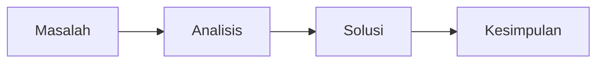

# Judul Tugas

## Pendahuluan

Jelaskan latar belakang topik, konteks mata kuliah, dan alasan kenapa pembahasan ini penting.

> Bagian pendahuluan sebaiknya cukup untuk membuat pembaca paham arah tulisan tanpa membaca materi lain dulu.
{: .prompt-info }

## Rumusan Masalah

- Pertanyaan atau masalah utama pertama.
- Pertanyaan atau masalah utama kedua.
- Batasan pembahasan jika ada.

## Pembahasan

Uraikan teori, konsep utama, dan analisis yang menjawab rumusan masalah.



> Hindari menumpuk definisi tanpa menghubungkannya dengan masalah yang dibahas.
{: .prompt-tip }

## Implementasi

Jelaskan metode, langkah pengerjaan, simulasi, konfigurasi, atau kode yang digunakan.

```python
def hitung(nilai):
    return sum(nilai) / len(nilai)
```

```javascript
const data = [80, 90, 85];
const avg = data.reduce((a, b) => a + b, 0) / data.length;
```

```bash
python3 main.py
```

```c
#include <stdio.h>

int main(void) {
  printf("hasil\n");
  return 0;
}
```

```cpp
#include <iostream>

int main() {
  std::cout << "hasil\n";
}
```

```yaml
nama: simulasi
mode: tugas
```

```dockerfile
FROM alpine:3.20
CMD ["echo", "tugas"]
```

> Pastikan data, asumsi, dan parameter yang dipakai ditulis dengan jelas.
{: .prompt-warning }

## Hasil

Paparkan hasil akhir dalam bentuk tabel, gambar, output program, atau poin analisis.

| Parameter | Nilai |
| --- | --- |
| Input | TBD |
| Output | TBD |
| Evaluasi | TBD |

## Kesimpulan

Tuliskan jawaban ringkas terhadap rumusan masalah dan hal yang bisa dikembangkan selanjutnya.
